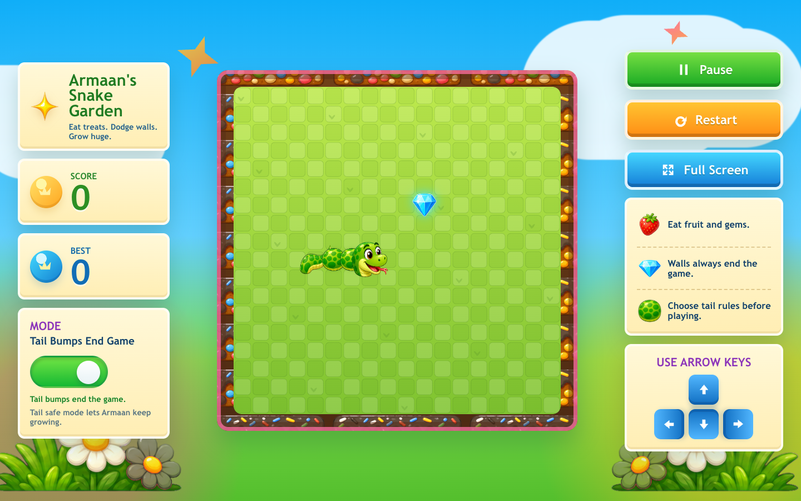
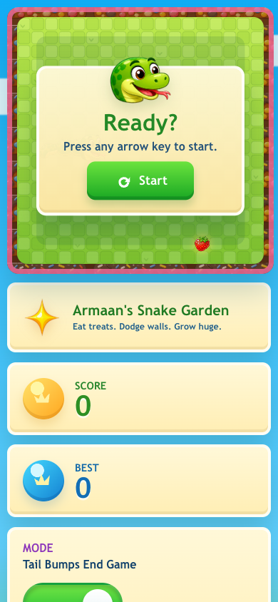

# Armaan's Snake Garden

A colorful browser Snake game built for Armaan.

<p align="center">
  
</p>

## Features

- Bright candy-garden game board with custom snake, fruit, gem, and flower art.
- Arrow-key controls, on-screen controls, pause, restart, and fullscreen.
- Score and best score tracking.
- Sound effects for treats, bumps, controls, and restart.
- Toggle between normal tail collision and Tail Safe Mode.

## Screenshots

<p align="center">
  
</p>

## Play

Use the arrow keys to steer the snake, eat fruit and gems, and avoid the outside walls.

The mode toggle changes the tail rule:

- Tail Bumps End Game: hitting your own tail ends the game.
- Tail Safe Mode: the snake can cross its own tail and keep growing.

## Run Locally

```bash
npm install
npm run dev
```

Then open the local URL Vite prints, usually:

```text
http://localhost:5173/
```

## Build

```bash
npm run build
```
